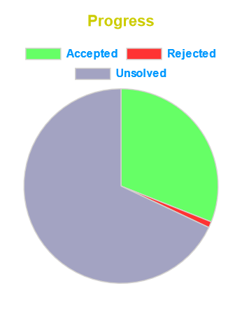

# ProblemsetVisualiser
 ProblemsetVisualiser is a firefox extension that adds a visualiser to show your progress on a problemset page of codeforces.

# Demo

# Steps to install
- Download the problemsetVisualiser.xpi file from this repository.
- Go to `about:addons` page in firefox
- Go to settings icon and click on `Install Add-on From File...`
- Click on `Add` in pop up and you are good to go :)

